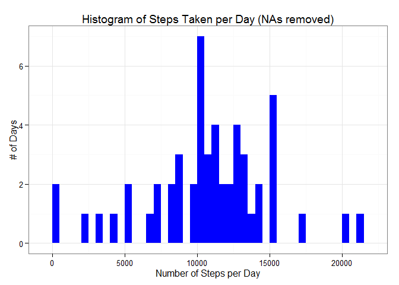
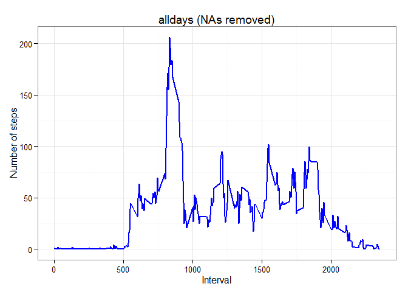
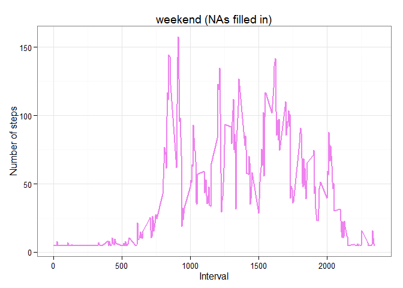
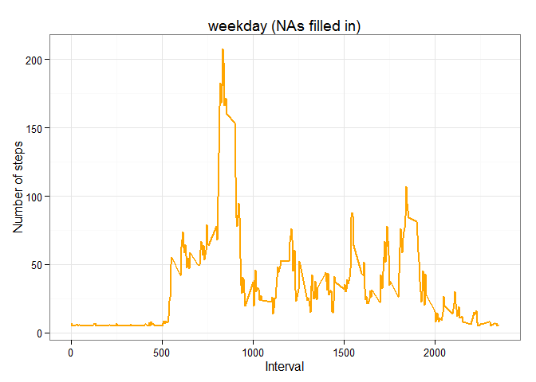

# Reproducible Research: Peer Assessment 1
scottb185

Load the required packages: 


```r
library(dplyr)
library(ggplot2)
```

# Load and preprocess the data:

Load the data:


```r
hpl<-read.csv("activity.csv")
```

The list has a bunch of NAs as shown below:


```r
head(hpl)
```

```
##   steps       date interval
## 1    NA 2012-10-01        0
## 2    NA 2012-10-01        5
## 3    NA 2012-10-01       10
## 4    NA 2012-10-01       15
## 5    NA 2012-10-01       20
## 6    NA 2012-10-01       25
```

Get rid of the NAs: 


```r
good<-complete.cases(hpl)
nonas<-hpl[good,]
head(nonas)
```

```
##     steps       date interval
## 289     0 2012-10-02        0
## 290     0 2012-10-02        5
## 291     0 2012-10-02       10
## 292     0 2012-10-02       15
## 293     0 2012-10-02       20
## 294     0 2012-10-02       25
```

# Calculate total steps per day:


```r
steps_per_day<-nonas %>% group_by(date) %>% summarize(steps = sum(steps))
colnames(steps_per_day)<-c("date","steps")
head(steps_per_day)
```

```
## Source: local data frame [6 x 2]
## 
##         date steps
## 1 2012-10-02   126
## 2 2012-10-03 11352
## 3 2012-10-04 12116
## 4 2012-10-05 13294
## 5 2012-10-06 15420
## 6 2012-10-07 11015
```

```r
tail(steps_per_day)
```

```
## Source: local data frame [6 x 2]
## 
##         date steps
## 1 2012-11-24 14478
## 2 2012-11-25 11834
## 3 2012-11-26 11162
## 4 2012-11-27 13646
## 5 2012-11-28 10183
## 6 2012-11-29  7047
```
# Make histogram with the total # of steps per day (NAs removed):


```r
ggplot(steps_per_day, aes(x=steps))+
        geom_histogram(fill="blue", binwidth=500) +
        labs(title="Histogram of Steps Taken per Day (NAs removed)",
        x="Number of Steps per Day", y = "# of Days") + theme_bw()
```

 


# Calculate and report the mean and median of total steps per day (with NAs removed):

Mean (with NAs removed):

```r
mean<-mean(steps_per_day$steps,na.rm=TRUE)
mean
```

```
## [1] 10766.19
```

Median (with NAs removed):

```r
median<-median(steps_per_day$steps,na.rm=TRUE)
median
```

```
## [1] 10765
```
# What is the average daily activity pattern?

Determine average steps per interval:


```r
alldays<-nonas %>% group_by(interval) %>% summarize(steps = mean(steps))
colnames(alldays)<-c("interval","steps")
head(alldays)
```

```
## Source: local data frame [6 x 2]
## 
##   interval     steps
## 1        0 1.7169811
## 2        5 0.3396226
## 3       10 0.1320755
## 4       15 0.1509434
## 5       20 0.0754717
## 6       25 2.0943396
```

```r
tail(alldays)
```

```
## Source: local data frame [6 x 2]
## 
##   interval     steps
## 1     2330 2.6037736
## 2     2335 4.6981132
## 3     2340 3.3018868
## 4     2345 0.6415094
## 5     2350 0.2264151
## 6     2355 1.0754717
```
Now plot the time series plot:


```r
ggplot(alldays, aes(x=interval,y=steps))+geom_line(color="blue", size=1) +
        labs(title="alldays (NAs removed)",x="Interval",y="Number of steps")+
        theme_bw()
```

 

# Which 5 minute interval, on average across all the days in the dataset, contains the maximum number of steps?


```r
maxint<-alldays[which.max(alldays$steps),]
maxint
```

```
## Source: local data frame [1 x 2]
## 
##   interval    steps
## 1      835 206.1698
```

Interval 835 had the max average steps (206).  

# Inputting missing values:

Total number of missing values (i.e. rows that had NAs):

```r
nas<-nrow(hpl)-nrow(nonas)
nas
```

```
## [1] 2304
```
So 2304 rows had NAs.

My strategy for filling in the NAs is just to count them as
37 (steps), which is the total steps / total intervals for the 
whole data set without NAs (570,608 steps / 15,264 intervals
=37.38 steps per five minute interval).

Note the NAs were all completely contained in two days in October
plus six days in November, and the NAs covered all 288 five minute
intervals in each of these eight days completely
(8 days * 288 intervals = 2304, which is the number of NA rows in
the set).

Now redefine the NA intervals as 37 steps and verify that a previous
'NA day' (like 10/1 for example) is now filled in:


```r
hpl[is.na(hpl)]<-37
head(hpl)
```

```
##   steps       date interval
## 1    37 2012-10-01        0
## 2    37 2012-10-01        5
## 3    37 2012-10-01       10
## 4    37 2012-10-01       15
## 5    37 2012-10-01       20
## 6    37 2012-10-01       25
```
If we filled in all the NAs, then # of rows with NAs should now be zero (it is):

```r
good<-complete.cases(hpl)
nonas<-hpl[good,]
nas<-nrow(hpl)-nrow(nonas)
nas
```

```
## [1] 0
```
Any previous 'NA day' (like 10/1 for example) should now have a total of 
37 steps * 288 intervals = 10,656 steps (it does; 10/1 shown below):


```r
steps_per_day2<-hpl %>% group_by(date) %>% summarize(steps = sum(steps))
colnames(steps_per_day2)<-c("date","steps")
head(steps_per_day2)
```

```
## Source: local data frame [6 x 2]
## 
##         date steps
## 1 2012-10-01 10656
## 2 2012-10-02   126
## 3 2012-10-03 11352
## 4 2012-10-04 12116
## 5 2012-10-05 13294
## 6 2012-10-06 15420
```

# Histogram after filling in the NAs:


```r
ggplot(steps_per_day2, aes(x=steps))+
        geom_histogram(fill="red", binwidth=500) +
        labs(title="Histogram of Steps Taken per Day (NAs filled in)",
        x="Number of Steps per Day", y = "# of Days") + theme_bw()
```

 

The result of filling in the NA intervals with steps = 37 is that 
that the red histogram above (with NAs filled in) has a higher peak
(that is, an additional eight days higher) at 
Steps Taken per Day = 37 * 288 intervals = 10,656 steps than the 
blue histogram (with NAs removed). 

# Calculate the mean and median (with filled in NAs):

Mean (with NAs filled in):

```r
mean<-mean(steps_per_day2$steps,na.rm=TRUE)
mean
```

```
## [1] 10751.74
```

Median (with NAs filled in):

```r
median<-median(steps_per_day2$steps,na.rm=TRUE)
median
```

```
## [1] 10656
```

So to summarize (in steps per day):

NAs removed: mean = 10,766; median = 10765

NAs filled in (=37 steps/interval): mean = 10,752; median = 10656

So not much change in mean/median (slightly lower), which makes sense because I 
picked a fill-in value equal to the overall mean.


# Are there differences in activity patterns between weekdays and weekends?

Here is the subset containing weekends only (starting with the filled-in complete
set):


```r
hpl$date<-as.Date(hpl$date)
hplwends<-with(hpl, hpl[(date>="2012-10-06" & date<="2012-10-07")
                        | (date>="2012-10-13" & date<="2012-10-14")
                         | (date>="2012-10-20" & date<="2012-10-21")
                         | (date>="2012-10-27" & date<="2012-10-28")
                         | (date>="2012-11-03" & date<="2012-11-04")
                         | (date>="2012-11-10" & date<="2012-11-11")
                         | (date>="2012-11-17" & date<="2012-11-18")
                         | (date>="2012-11-24" & date<="2012-11-25"),])                            
                        
cou<-nrow(hplwends)
cou
```

```
## [1] 4608
```

And here is the subset containing weekdays only:


```r
hplwdays<-with(hpl, hpl[(date>="2012-10-01" & date<="2012-10-05")
                        | (date>="2012-10-08" & date<="2012-10-12")
                         | (date>="2012-10-15" & date<="2012-10-19")
                         | (date>="2012-10-22" & date<="2012-10-26")
                         | (date>="2012-10-29" & date<="2012-11-02")
                         | (date>="2012-11-05" & date<="2012-11-09")
                         | (date>="2012-11-12" & date<="2012-11-16")
                         | (date>="2012-11-19" & date<="2012-11-23")
                         | (date>="2012-11-26" & date<="2012-11-30"),])
                        

cou2<-nrow(hplwdays)
cou2
```

```
## [1] 12960
```
Rows (all days) = rows (weekends) + rows (weekdays) = 4608 + 12960 = 17568,
which is correct (17568 rows is the length of the original data set).

Get average steps taken per interval for weekend days:


```r
wemean<-hplwends %>% group_by(interval) %>% summarize(steps = mean(steps))
colnames(wemean)<-c("interval","steps")
head(wemean)
```

```
## Source: local data frame [6 x 2]
## 
##   interval steps
## 1        0 4.625
## 2        5 4.625
## 3       10 4.625
## 4       15 4.625
## 5       20 4.625
## 6       25 7.875
```

```r
tail(wemean)
```

```
## Source: local data frame [6 x 2]
## 
##   interval   steps
## 1     2330  5.6875
## 2     2335 15.6250
## 3     2340 10.5000
## 4     2345  6.2500
## 5     2350  4.6250
## 6     2355  4.6250
```

Get average steps taken per interval for weekdays:


```r
wdmean<-hplwdays %>% group_by(interval) %>% summarize(steps = mean(steps))
colnames(wdmean)<-c("interval","steps")
head(wdmean)
```

```
## Source: local data frame [6 x 2]
## 
##   interval    steps
## 1        0 6.955556
## 2        5 5.333333
## 3       10 5.088889
## 4       15 5.111111
## 5       20 5.022222
## 6       25 6.244444
```

```r
tail(wdmean)
```

```
## Source: local data frame [6 x 2]
## 
##   interval    steps
## 1     2330 7.622222
## 2     2335 6.555556
## 3     2340 6.733333
## 4     2345 5.111111
## 5     2350 5.200000
## 6     2355 6.200000
```
Plot the average steps per interval on weekends:


```r
ggplot(wemean, aes(x=interval,y=steps))+geom_line(color="violet", size=1) +
        labs(title="weekend (NAs filled in)",x="Interval",y="Number of steps")+
        theme_bw()
```

 

Plot the average steps per interval on weekdays:


```r
ggplot(wdmean, aes(x=interval,y=steps))+geom_line(color="orange", size=1) +
        labs(title="weekday (NAs filled in)",x="Interval",y="Number of steps")+
        theme_bw()
```

 

# Conclusion

Yes, there is a difference in activity patterns between weekdays and weekends.

From the data it appears that people were more active on the weekends
(i.e. higher average steps per interval, in general)
than they were during the week.

Two exceptions to note: people walked more on weekdays than they did on weekends
around intervals 800 (8:00 am) and 1800 (6:00 pm); this can possibly be attributed
to people going to and from work on weekdays.  


